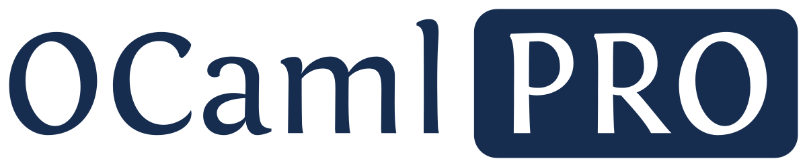

[OCamlPro](https://ocamlpro.com) is a French software company, with a
strong expertise in programming languages & formal methods, and 10+
years' experience in state-of-the-art developments. Open-source is
part of our Dna!

We have developed an expertise in several programming languages, and
of course, we are always happy to learn new ones or even create them!

Here is a list of languages that we have used or developed tooling
for:

* [OCaml](https://ocaml.org): we develop most of our language code in
  OCaml, and participate in the development of an optimizing compiler
  for OCaml

* [Rust](https://www.rust-lang.org/fr): our [Red Iron
  Team](https://red-iron.eu) develops our performance-critical code in
  Rust

* [COBOL](https://wikipedia.org/wiki/Cobol): we develop tooling for COBOL, and participate in the maintainance of [GnuCOBOL](https://github.com/OCamlPro/gnucobol)

* [M-lang](https://mlanguage.github.io/mlang/mlang/index.html): we work on the development of a production ready version of M-lang

* [Coq](https://coq.inria.fr/): we use Coq to prove Cybersecurity
  guarrantees on code

* [Web Assembly (WASM)](https://webassembly.org/): we work on tooling
  to target web assembly from other languages

* [Solidity](https://soliditylang.org/): we have developed tooling for
  several smart contract programming languages, among which Solidity,
  Liquidity, Michelson.

We also maintain an automatic theorem prover, called
[Alt-Ergo](https://github.com/OCamlPro/alt-ergo), and used to verify
software by different platform such as [TIS
Analyzer](https://trust-in-soft.com/),
[Spark](https://www.adacore.com/about-spark) or
[Frama-C](https://frama-c.com/).
